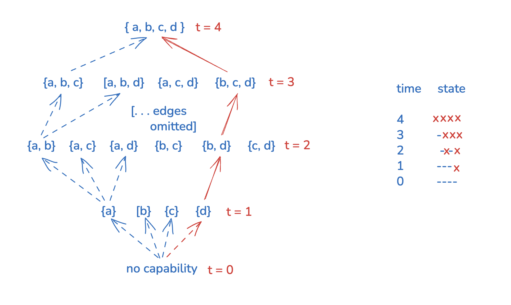
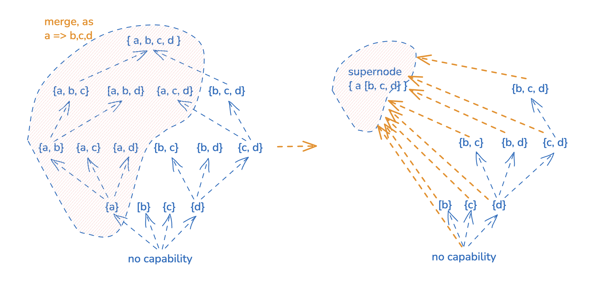

Security people often use the following terms to describe movements in the hacking process: "vulnerability chaining", "horizontal/lateral movement", "escalation", etc. If there's some satisfaction in using those terms, that's because these terms refer to the process' _internal structure_. This internal structure is very intuitive and known to folks, even if it was not ever written down explicitly. 

In this blog post, we look at what that underlying structure looks like. The struture is a restricted variant of acyclic graph (DAGs), morphed into a simpler structure. Apart from that, in this blog post, based on our practical application of (restricted) DAGs, we hope to provide a lookout from which the full DAG generality becomes (at least partially) visible.

### 1. Attackers don't play Mahjong 

In the Mahjong Solitaire game, the goal is to identify duplicate pieces on the board, after which they're removed. The process is repeated until there are no pieces on the board. Mahjong can be seen as trimming a DAG. A leaf node of a DAG is removed which "frees up" other nodes, allowing their removal in one of the next steps. 

One could consider that a privilege escalation process encountered in computer system hacking follows this pattern. After all, it _is_ true that the process is tedious and requires lots attention, so that does check out. One may also consider the hacking process to involve acquiring "gadgets", or "capabilities", similar to Mohjang Solatiare. 

However, Mohjang Solitaire follows a certain _steady pace_; unlocking Mahjong pieces does not include rapid state changes. This is where the Mahjong Solitaire analogy with the computer hacking fails. The privilege escalation process follows a specific dynamic, not followed by some other processes out there. That dynamic has at least the following two properties:

* It's usually _cumulative_ in terms of attacker's capability 
* it includes _sudden, dramatic changes_

### 2. Attackers play one-way poker

The first thing that comes to mind when representing a process with rapid changes is a transformation, over some state. Consider the following state trail:

```
time         state
0     -------------------- 
1     x-------------------
2     x-------------------
3     xx------------------
4     xx------------------
5     xx------------------
6     xx------------------
7     xx--------x---------
8     xxxxxxxxxxx---------
9     xxxxxxxxxxx--------x
10    xxxxxxxxxxxxxxxxxxxx
   ...

```
The "avalanche" effect is the rule that a flip in bit k results in bit flips in all bits j < k. Avalanche is present in steps 8 and 10. A computer hack involves _capabilities_; for example the capability to authenticate as a system user or the capability to read an arbitrary file on disk. 

For a given system, we're looking at a set of capabilities:

```
p1, p2, p3, ... p_n
```
Bit position k corresponds to `p_k` and `-` means that the actor does not yet posess the capability. An attack on say a Windows network progresses with the attacker's capability of running commands in a Docker container (step 1), then expanding the capability to running code on a host in the network (2), access to internal services keys repository (step 7) and finally step 10 establishing control at the domain controller of the network, which allows access to all capabilities. 

### 3. Attacker inside the Boolean cube

The problem with the previous section is that it requires a `p_i => p_i-1` for all `p_i`. This does not correspond to reality; there may be multiple independent paths to the full capability or privilege set. To represent this, we use a "power set" (a set of all subsets) of the set of capabilities. 

<p align="center"> </p>
The power set forms a graph in which movement from the bottom towards the top of the graph signifies privilege escalation. For example, a file read on the local system may provide the attacker the ability to read a configuration file and authenticate to related database; this is represented as movement from `a` to `{a,b}`. 

Some privilege escalations are known to be impossible. A pair of capabilities may refer to independent parts of the system. The trails in practice will simply not flow over certain routes. Such unworkable edges can be removed from the power set graph. It should be noted that the possibility of privilege escalation is probabilstic in nature. For example, an XSS payload may or may not execute. A phishing attempt succeeds with a certian probability. An ASLR bypass such as a sprayed heap may yield to a desired outcome, or may not. An LLM may or may not identify an exploit that'll allow an escalation. 

A meta note about graphs: each movement the power-set graph is "coordinate-wise", which is why [Boolean hyper-cubes](https://en.wikipedia.org/wiki/Hypercube_graph) are a good alternative way of representing power sets. Capabilities are identified with positions in an n-tuple and from each capability set, it's possible to independently "unlock" or "lock" any other capability (flipping the bit at that position or moving across an edge in the hyper cube). All in all, power-set graphs are a heavily restricted variants of DAGs, which are a very general notion.

### 4. Quotient of the power set graph

Our previous model fails to capture the "avalanche" property. As mentioned earlier, the computer hacking process involves sudden changes. A full set of capabilities is gained suddenly, in one passage. Paradoxically, in order to gain a single capability (such as, read from a database), often times, the attacker gains the full set of capabilities.

To model this, we add some back-propagating implications to the system. A capability "back-propagates" a number of other capabilities. For example, running code on the host system implies access to all application users, administrators as well as access to secrets in configuraiton files (three capabilities). This is modeled as `a => b, a => c, a => d` in the picture above. 

With this information present, the graph becomes highly redundant. Nodes should be merged; in graph theory this is called an Strongly Connectected Component (SCC) quotient graph of the original graph. There's a single state that includes `a` now, as shown on the picture on the picture. The super node is, for example, unrestricted code execution on a host. 

<p align="center"> </p>

### 5. DAGs encode arbitrary progressions

Instead of conclusion, let's spend some considering what more general DAGs can represnt. Specifically, let's of think of DAGs as models of "passage" of time:

* DAGs have "orientation" and moving from the bottom to the top corresponds to passage of time
* A DAG trail from bottom to top corresponds a choice of events that may have taken place
* The more complicated the DAG is, the more subtle event inter-dependencies are 
* Power-sets or Boolean cubes are heavily restricted DAGs
* Specifically, power-set graphs erase "dependencies" between coordinates; in power-set graphs, it's possible to "unlock" a capability regardless of what other ongoing state is

The type of progressions we looked at in this blog post are well modeled with the very restricted variant of DAGs. But what type of real-world progression requires a richer DAG structure, such as interleaved connections and feature dependency? 

