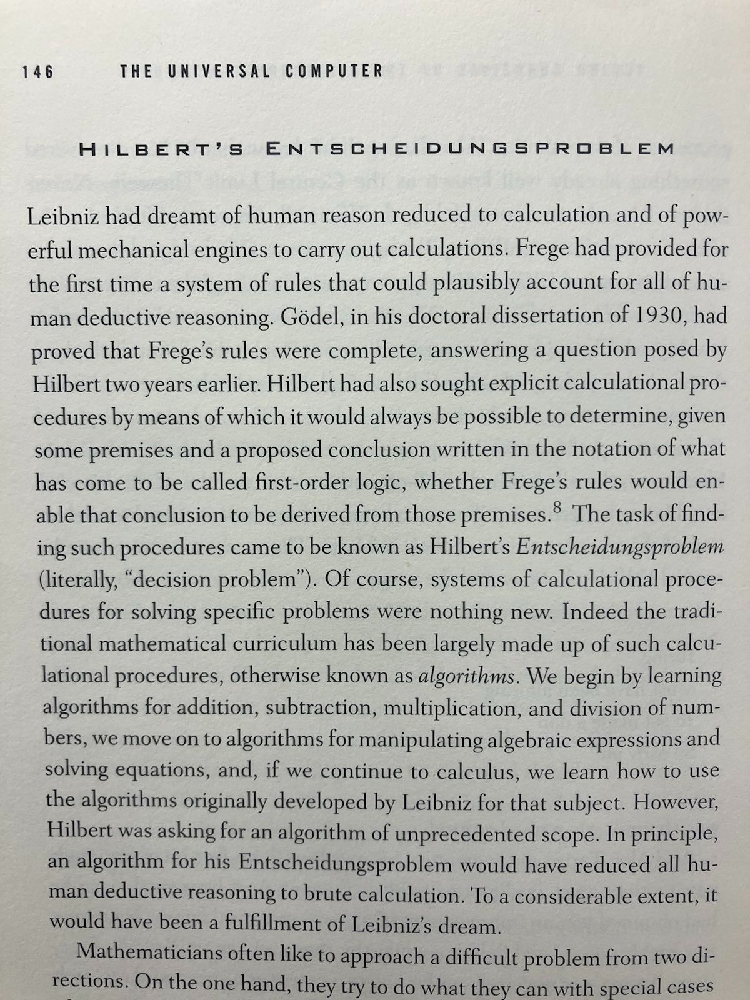
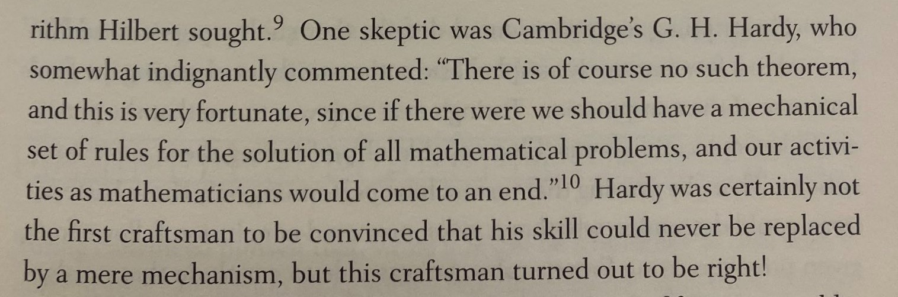
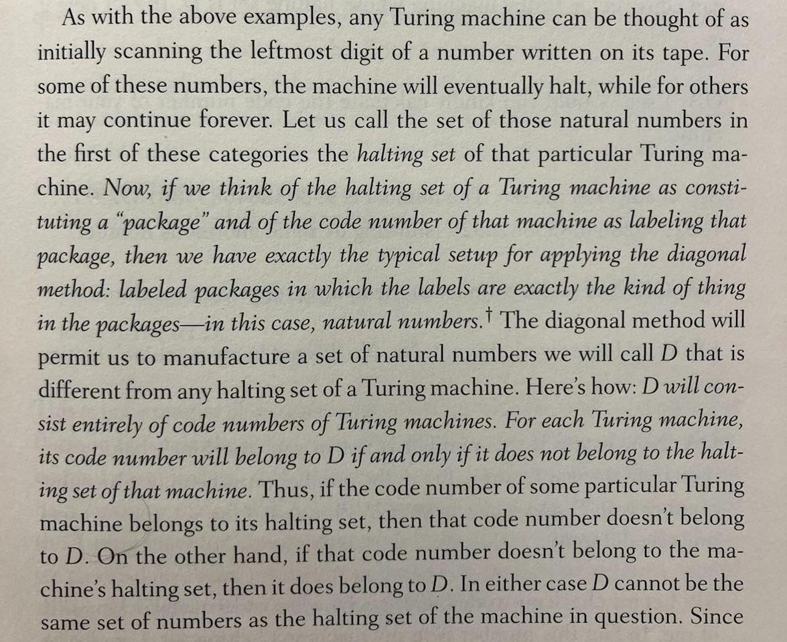

I've been working from a public library a lot, sitting in between shelves filled with wonderful books. Here is some book content, hopefully this doesn't break any copyright laws. 

## The Universal Computer (Martin Davis, 2000)

There's something in going from only a pre-defined set of state transitions in a system, to making the transitions fully programmable by the system's users. Examples that come to mind are going from a "static" editor to Emacs, introducing Javascript to the static HTML/CSS web as well as going from a contract-less blockchain to a fully programmable one. Could it be that a novel and useful system could be built just by making what appear to be static state transitions fully programmable?

The 'mother' of all such transitions is described in this book, particularly, by the two introductory quotes:

 

The book describes how in the early days of computers, it has not dawned on everyone that the universal computer is what needs to be built. That's the first quote. The second quote appears to be on an altogether different level: not only it suggests that a universal computer is what needs to be built, but is based on a research of **what "fully programmable" actually means**, a research conducted by Turing and others in the 30ties and leading up to the Church-Turing <a href="https://en.wikipedia.org/wiki/Church%E2%80%93Turing_thesis">thesis</a>. 

#### From Leibniz to Turing

From Leibniz to Hilbert:

 

A condensed account on:

* How Leibniz _in his early teens_ (mid 17th century), after getting acquianted with Aristotle's logic from two millenia earlier, had the idea of logical reasoning via symbolic operations/computation. Later in life, he had an idea of a machine that would perform such computation. It is not clear from the book whether the idea of a machine actually originated from his teens, or whether this was something that came later
* In 1879, Frege provided roughly the symbolical machinery that Leibniz envisioned in a booklet of fewer than 100 pages, titled  "Begriffsschr
ift" which is roughly translated to "concept script". A concept script! 
* In 1928, Hilbert, apparently without any reservation or holding back, asked for the algorithm of an "unprecendent scope", that would "reduce all human deductive reasoning to brute calculation"

Early non-believers in such a possibility include:

 

To fill in the missing parts of Leibniz's dream and Hilbert's problem, in the 1930-ties, Turing modeled a human that performs steps by writing in a notebook, coming up with the concept of a Turing machine. Admittedly, **it is a rather unusual object to model mathematically - a human, or an entity that is able to follow pre-defined steps, writing in a notebook**. 

Rough outline of the proof that there exists an input set for which no algorithm can decide:

 
Such a "non-regular" input set is defined in reference to all computable sets, using the Cantor's diagonalization method. Somewhat contrived, but does the job and the overarching blanket aspiration of having a general algorithm gets a reality check. 

