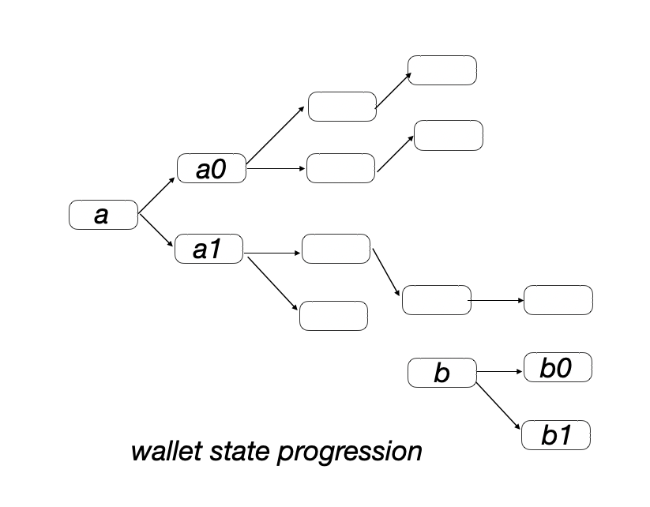
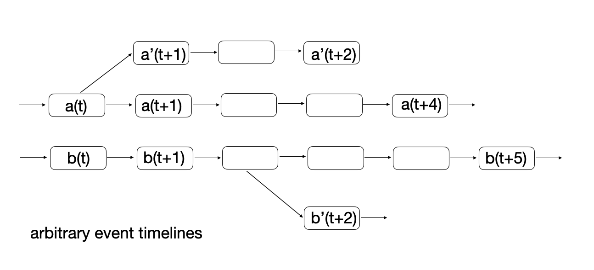

Some years ago, a friend told me the following story. During the 80ties, he was dabbling in computers with some fluctuating amount of interest. This went on for a while, his enthusiasm for computers went up and down, but lingered. However, at some point in his early teens, in a local journal, he saw a picture of _a computer connected to a telephone_. That triggered something in his adolescent mind and he got sucked deep into the world of computing. 

There's a another story related to young folks dreams about computers. It's that a simple blob of bytes, residing solely in one's personal computer, has real world value, independently of the real world. It's a sort of thing where bytes on one's screen draw out into a different dimension; they're exclusively inside a (personal) computer and yet magically extend into reality. 

### Introduction

As we know, the key event was the invention of Bitcoin somewhere before 2008 when a mysterious figure Satoshi Nakamoto published the Bitcoin paper. Satoshi did not reveal his identity up to this point. We can, however, guess that Satoshi possibly had a moment almost 20 years ago (it is now 2025), in which he realized that **this thing is actually possible** or **this may in fact work**. 

It was an idea on how to resolve a specific problem that arises when you attempt to model the behavior of _physical gold_ in the digital world. In this blog post, we'll attempt to recreate the process of discovering Bitcoin and note what was expected and what was unexpected in this effort. 

### 0. Physical gold: the spec

Consider the problem of modeling _physical gold in code_. We'd like to have information that behaves like gold and exist only in the digital realm. Note that this appears impossible at a glance; physical gold is a tough nut to model. It's not _at all_ like a "typical" programming project, such as creating a ticketing system for tasks that employees ought to finish at some company, or a weather application that picks up data from a measuring station.

Modeling physical gold is thorny because of the following properties:

* (G1) You can exchange gold without any help or supervision from a third party
* (G2) You cannot be prevented from exchanging gold; it is not censorable
* (G3) You ought to be able to mine gold, a third party cannot prevent you from doing so

Note that there are also some properties of physical gold that Bitcoin does not replicate:

* (Z1) Gold has no serial number like cash does
* (Z2) There shouldn't be any trace of a gold exchange that took place

To model the latter two properties, it's necessary to use further mathematical weaponry which wasn't necessarily available in the early Bitcoin times - so we'll put these properties aside when it comes to this text.

### 1. Why not just send some hash preimages over email

Let's start with a simplest thing possible. Satisfy (G3) by having digital gold be represented as a solution to a hard-to-solve equation. The equation is public, there are no shortcuts; it's not hard to find such a puzzle, take for example inverting a [hash function](https://en.wikipedia.org/wiki/Cryptographic_hash_function). This is called [Proof of Work](https://en.wikipedia.org/wiki/Proof_of_work).

What do you do with solutions that represent digital gold? Send them over email or chat apps to exchange them for goods? That wouldn't work, as such digital gold could be arbitrarily copied and re-spent once it's received. There's no notion of who owns what; and thus we arrive to the notion of a non-tamperable notebook of who owns what: a [_ledger_](https://en.wikipedia.org/wiki/Ledger). 

### 2. A trustless ledger

The digital ledger records who owns what, by way of recording all transfers that ever took place in the past; it's an ever growing database. The ledger must not be stored and maintained by a single entity, as that entity could simply delete the ledger, ending the story right there (and violating G1, G2 and G3). 

In other words, the ledger ought to be replicated among peers who join the network at will. A [P2P](https://en.wikipedia.org/wiki/Peer-to-peer) network is the right thing here; have each participant store the ledger and broadcast transactions to neighbouring nodes as they arrive. The nodes update the ledger accordingly if transaction validation checks out. 

Participants ougthn't be able to appropriate other users' funds; a way to authorize transfers is needed. As there's no central authority or server here, a [cryptographic signature](https://en.wikipedia.org/wiki/Digital_signature) is the correct primitive to use. With cryptographic signatures, participants hold secret keys, while the public can validate each signed transfer with a corresponding public key.

Transactions are then signed messages that refer to existing entries on the ledger (so called _unspent outputs_ or [UTXO](https://en.wikipedia.org/wiki/Unspent_transaction_output) in Bitcoin), spending the totality of a previous ledger entry and potentially sending it off to multiple new public keys. Transactions are broadcast on the network and in order to be in sync with the changes on the network, on each transaction, participants update their view of the ledger. 

We can now visualize what we envisioned: the P2P network (on the left) and the state of the ledger (on the right). Nodes represent addresses (signature public keys) and edges represent transfers. This visualization does not capture entity ownership; in practice, many public keys can be held by a single entity. In fact, we can imagine that public keys are never reused, therefore the concept of ownership is completely hidden in the picture.

<div style="display: flex; justify-content: space-between;">
 
 
</div>

### 3. Inside the mines of Bitcoin

Note that in the wallet picture above, there's more than one root from which new digital gold emerges; these are instances where new digital gold was _mined_. Specifically, to simulate physical gold mining (G3), we introduce a special kind of transaction which doesn't reference a previous unspent output. Rather, it validates the `counter` solution for a hash puzzle such as:

```
hash(receiving-address | counter)
```

The `counter` value is such that there is `n`  leading zeros in the output of the hash function, which is a problem that takes around `2^n` attempts. We added the `receiving-address` field into the hash in order to mitigate reusing solutions across transactions; this is a security-relevant detail, we'll just leave it there, even though we don't try to be very precise in this text. 

This looks like a promising direction; there's nothing necessarily problematic that we're encountering yet. The mining process could be modulated in sponge-like manner; its difficulty can increase and decrease based on some function. Some transactions mine new gold, some send it off elsewhere. 

### 4. Turn the light on, use a hash chain 

There's a problem, however: nodes are in the dark on what exactly other nodes see as _their_ ledger. A node really has no way of knowing what other nodes see as their valid set of transactions. If a node goes offline, it doesn't know where to catch up from, what to ask for or what tranasctions should they include in their ledger.

A hash function such as SHA2 can be used to summarize the state of the ledger. In the left-hand side of the picture, a hash of the whole ledger is computed after each transaction. A hash sequence thus uniquely represents the ledger's evolution: 

<div style="display: flex; justify-content: space-between;">
 
 
</div>

Note that on the left, transaction processing means repeated re-hashing of the whole ledger. To optimize, recursive or _chained_ hashing is introduced (picture on the right). Now, nodes only hash the previous ledger hash and the new transaction content, as opposed to constantly re-hashing the whole ledger, which is much better.

This chained hashing scheme can be seen as a "unary tree" (as opposed to a binary tree) and a simplified variant of a [Merkle tree](https://en.wikipedia.org/wiki/Merkle_tree), where the number of child nodes is set to one. Merkle trees and  such concepts arise when we're given a black box hash function, we hash a bunch of data and we ask questions such as:

* What is the cost of _proving_ that a subportion of the hashed data participates in the hash?
* What is cost of _updating_ the hash if we're given some modifications to the underlying data?

These questions were tackled by Merkle in 1979, but let's leave this topic for other explorations. 

Finally, to avoid ambiguity in transaction processing, we can also imagine for now that previous ledger hash is included inside each transaction. Also, each node will run a heuristic to ensure they're in sync with other nodes. Specifically, nodes occasionally exchange the last `n` hashes with neighbouring nodes and then fetch or contribute known transactions to establish the collective ledger.

### 5. The problem

Previous steps were not unexpected engineering moves. The main problem is now in front of us. Recall that we have a P2P network that maintains a common chain of transactions. The ledger's progression over time represented as a sequences of hashes.

The problem is that an arbitrary number of possible competing histories can be created, as shown in the picture. If you're a node in the network and a _different history_ is presented to you, how do you decide if that's your history, or not?

<p> </p>

For example, such an alternative history may curiously lack a _certain_ transaction, which was already billed out in the real world. Therefore, switching between histories is dangerous; it can mean loss of huge amounts of funds and renders the system completely useless. Another variant of this attack includes broadcasting a double spend transaction to intentionally split the network. The network must be able to recover from such a split. 

Observe that here the probelm is _not_ to _decide which historical fork is the right one_, as all forks are equally right. All of the transactions in all forks were signed by correct participants and therefore they're all correct. A criterion for accepting a historical fork is needed, such that these two propreties are satisfied:

* _Security_: it is not possible to double-spend. 
* _Flexibility_: nodes can recover from network splits.

Let's explore some ways how malicious history alteration could be mitigated. 

### 6. Attempts to solve the double-spend problem

Attempts to defend against variants of the double-spend attack are below. 

1. Length-based cutoff: The longest chain is considered as the authoritative chain. In such a case, an attacker can artifically extend the chain to have the network swap back and forth between histories, resulting in a double-spend attack.
2. Seal-based cutoff: The longest chain is authoritative, but a node will switch to a different chain only if the change doesn't go deeper than `n` (e.g. 50) hashes. Users will consider transactions _finalized_ only if they're buried underneath more than `n` hashes. With such a rigid rule, there's danger of a permanent network split. At each point, an attacker can present a competing chain forking off the existing chain about `n` hashes away, resulting in one part of the network accepting the first chain and the other the second chain. Now a double-spend can be processed _twice_ by two portions of the (split) network.
3. Rule-based cutoff: Attempt to introduce some rule (independent of the ongoing state) that'll determine which fork is authoritiative. Say, we'll choose the fork whose hashes are a minimal in terms of alphabetical ordering. The problem is - an attacker can simply mine for favorable hashes and overtake any fork and thus double-spend. 

None of the attempted solutions works, and it's unclear how to proceed. 

### 7. "Bitcoin: A Peer-to-Peer Electronic Cash System"

Satoshi's idea is to use the concept of "Proof of Work", which was an esoteric concept back in 2008[^1]. More specifically, his idea is to use PoW to establish a secure voting criterion on what's valid history. The criterion is such that it's secure (history is _sealed_ after a certain amount of events and thus prevents double-spend) and flexible (network forks get resolved and do not result in permanent splits). Satoshi introduces the following:

* Network nodes require a proof of work on each acceptance of new historical events
* Transactions are grouped into _blocks_ and only blocks accompanied with a proof of work are accepted
* If there are multiple chain forks, the chain with the most _cumulative_ work is considered authoritative

This makes forging an alternative history difficult. If I'm an attacker trying to swap out the current history with my own sequence of events, I'll have to out-mine the network on over more than `n` blocks, before I get it to accept my chain. Thus, the _security_ property is satisfied. As for chain splits (the _flexibility_ property), if more than one competing chain exists, network nodes automatically choose the one with the most cumulative work. This makes any splits non-permanent, as the competition makes a single chain prevail.

Note that the difficulty of the PoW puzzle dynamically increases or decreases, based on the participation in the mining process. We end up with the following: **the (honest) collective has a stronger say than a resourceful attacker**. It's shown in section 11 of the Bitcoin paper that an attacker attempting to compete with the main network's fork drops exponentially.

Finally, recall that we started by simulating (physical) gold mining with solving proof of work puzzles: if you're to create new gold, you have to mine. However, we've discovered that proof of work can be used for _an entirely different purpose_; and that is to seal a historical event line. We may then combine the two usages of proof of work:

* To secure the event line on the ledger and 
* To emulate the process of gold mining

Given that each block contains a solution to a proof of work puzzle, it is also made to mine new digital gold. 

[^1]: Proof of work can be thought of "soft" or "flexible" cryptography. In "regular" cryptography, access is gated with an unattainable number of operations such as `2^128`, in order to e.g. forge a cryptographic signature. Therefore, "regular" cryptography is a sort of "all or nothing" access cryptography. It is worth noting that "traditional" cryptography idealizes what we have in the real world. In the real world, if someon _really_ wants to rob your house, they _could_ do so by paying a potentially high price and with lots of preparation. In the digital world, this could be modeled faithfully, by using a proof of work function instead of a "all or nothing" function. With proof of work, access is gained with a substantial, but attainable number of operations, such as `2^24` to `2^72`. It turns out that, in some situations, solving the problem simply necessitates this "flexible" type of cryptography and not traditional "all or nothing" cryptography. We've already seen an example of that when we mentioned simulating mining of gold (together with the crazy idea of sending such solutions over chat apps or email). Anyone _can_ mine gold and it's _attainable in practice_. Proof of work is simply the right key for that keyhole. 

[^2]: The same idea of hash chains was used in this 1991 [paper](http://www.staroceans.org/e-book/Haber_Stornetta.pdf) by Haber and Stornetta: _How to Time-Stamp a Digital Document_. They tackled the question how to time-stamp documents in a trustless way. You could have a service that'll time-stamp documents just by cryptographically signing them with a timestamp as they arrive from users. In collusion with submitters, such a signer can forge time-stamps single-handedly. The idea is to have the time-stamping service provide signatures over _links_ of a _hash chain_, so that maliciously forward or back-dating documents would require _breaking the chain_. The chain is secured by trustworthiness of adjacent entities (humans, or organizations) in the chain, who aren't expected to attest to something that didn't happen. In that sense, the Haber and Stornetta chain was _sealed_ by trustworthiness. 

[1] _Bitcoin: A peer-to-peer electronic cash system_ https://bitcoin.org/bitcoin.pdf
[2] _How to time-stamp a digital document_: Haber and Stornetta http://www.staroceans.org/e-book/Haber_Stornetta.pdf
[3] _Bit gold_, Nick Szabo https://nakamotoinstitute.org/authors/nick-szabo/

**Disclaimer**: this blog post doesn't endorse or suggest buying Bitcoin. On the contrary, I vaguely believe most of the original intent behind Bitcoin was lost over time and "in translation". I do believe that other solutions in the space now carry the torch of the original idea. 

