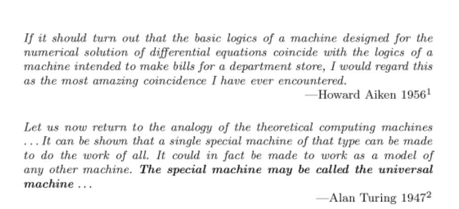
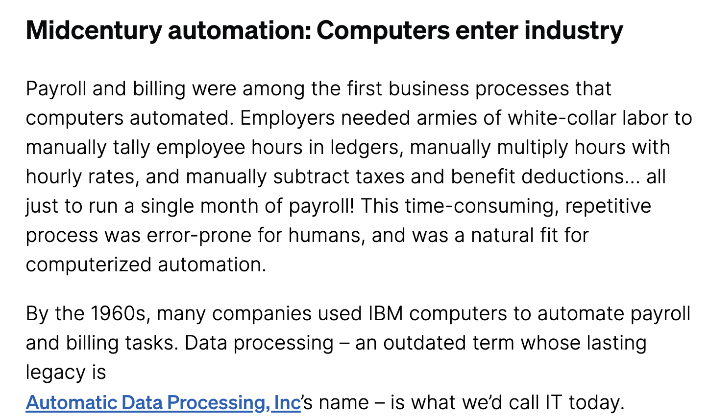

In school they teach that the exponential function is surprising in that the speed at which it grows is counter-intuitive.  It explodes so fast that it never fails to surprise us. In the twinkling of an eye, it has fully propagated and we're left wondering **what just happened.** It models phenomena such as pandemics, chain reactions, avalanches, etc. 

But there's another surprising thing that's not talked about in school, at least not in high school and apparently not in undergraduate school either. It has to do with the **scope** and **expresiveness** general purpose computing. Because of this expresivness, it can capture aspects of our society in unexpected ways and modify our life for good, or for bad. 

This isn't  taught in school, there's usually no teachers in awe of Turing's machine generality telling students what efficient general purpose computers can do - yet it's there, palpable and we seem to be discovering it, step by step. After all, the question that we're nowdays asking - whether [AGI](https://en.wikipedia.org/wiki/Artificial_general_intelligence) is possible - is related to this, which Turing seemed to [touch upon](https://redirect.cs.umbc.edu/courses/471/papers/turing.pdf) before 1950s. 

<!-- He did this to answer David Hilbert's question if there exists a procedure that solves each instance of a certain kind of problem in algebra. If we're to show that there is or there isn't such a procedure, we have to know what a procedure is - that's where the Turing machine comes in.  -->

<!-- Recall that it was Alan Turing _studied_ general purpose computing mathematically. He invented a formalism that represents a general purpose computer that we now call the Turing machine and proved that there are some _limits_ to what it can do. Problems that cannot be solved algorithmically. --> 

### The Martin Davis book quote

Consider the opening quote from the book "The Universal Machine" by Martin Davis:

My reading of the two quotes is as follows. Aiken and Turing talk about the same thing. They approach the same matter - the same realization, from two different sides. 

Howard Aiken's quote states surprisal, coming to the realization of what general-purpose computing means. You could say Howard Aiken is _approaching_ the realization; he's not yet on the other side, but willingly or unwillingly moving towards it. 

And Turing is talking from the fully realized perspective of what general purpose computation will mean in the time to come. _He is certain in his stance that he came to inhabit so early and could have never been forced out of_. He's bullish and foresees the times to come in what may be full clarity. 

### What a computer can(not) do?

When we study some real-world phenomenon using scientific method, we represent the real-world process using a formal model. Once we have the formal model, it becomes possible to reason about the phenomenon, assuming the model is *faithful* to what it's representing. If we want to know about an oscillating string, we write down some equations and then study the solutions to the equations. 

What if we want to reason about a computer? Alan Turing made a formal model that models general purpose computing, which we nowdays call the Turing machine. Turing did this to answer a particular [question](https://en.wikipedia.org/wiki/Entscheidungsproblem) posed in 1928 - if there exists a a computational process that solves each instance of a certain kind of problem. If we're to show that there is or there isn't such a process, we have to know what computation is - that's where the Turing machine comes in. 

Whether a Turing machine is faithful to the non-formal notion of algorithm is not a statement that can be proved and this is where the [Turing-Church](https://en.wikipedia.org/wiki/Church%E2%80%93Turing_thesis) hypothesis comes in. Note that the same holds for any other kind of formal model, only we don't usually have a dedicated "faithfulness" hypothesis, as the real-world counterpart is usually more straightforwrd than the notion of algorithm or procedure and there's no need to have an explicit thesis. 

With this, Turing showed that there are *limits* to what a Turing machine can do. From Turing, we've learned what computing **cannot do**. Still, this did not exactly tell us what general purpose computing **can do** and especially not how it'll affect us down the line. 

### How to bend a Turing machine

Arguably, there are less surprising applications, more surprising applications and extremely surprising applications which really *bend the notion* of what we expect from a computer. Here we have some more humble examples, as this is just a blog post after all. 

#### 1. Payroll automation

Check out this very good [blog post](https://retool.com/blog/erp-for-engineers) about ERP. Perhaps this is not surprising at all, as after all, with his machine, Turing modeled a human executing a pre-defined arbitrary of sequence, see section 4 (Digital computers) in his [paper](https://redirect.cs.umbc.edu/courses/471/papers/turing.pdf):

> The idea behind digital computers may be explained by saying that these machines are intended to carry out any operations which could be done by a human computer. The human computer is supposed to be following fixed rules; he has no authority to deviate from them in any detail. We may suppose that these rules are supplied in a book, which is altered whenever he is put on to a new job. He has also an unlimited supply of paper on which he does his calculations. 

This is arguably what the payroll departments used to do. ERP blog post screenshot: 

#### 2. Process optimization

The previous example, payroll, can be thought of as a very coarse model for human activity, devoid of all details - a numerical summary of what we've been doing. As such, payroll automation models human behavior (at some level). 

Going beyond the coarse level of describing state, there's a myraid of state machine templates and special-purpose programming langauges for specifying such state machines. I won't attempt to list them here, refreshing HN a couple of days in a row will result in a number of examples. A couple of years ago, I happened to workin at a startup. The job did not end up working out too well and I didn't really end up contributing to its product. Still, a part of the product was interesting - it was a language that expresses financial dependencies in a multi-party setting. It allowed financial institutions to write down in code what would otherwise have executed and overseen by employees of a financial institution. Not only it modeled common contracts, it allowed programming such contracts by third parties. Certain computation performed jointly by humans in the past is therefore simulated and executed by a computer. 

#### 3. Cryptography, etc. 

A good place to look for surprising applications is cryptography. Cryptography models societal relationships and these seem a tough nut to model, as they do not appear to be described by firm and discrete rules. 

Take for example [cryptographic signatures](https://en.wikipedia.org/wiki/Digital_signature). Real-life signatures are tied to documents, they can be validated, but not generated, by unauthorized parties. Some creativity is needed in order to model these principles:

* Real-life difficulty (eg. difficulty of signature forging) can be modeled with computational difficulty.
* Role separation (the signer on the one hand and the public on the other hand) can be realized by the separation between private and public key.
* Computationally difficult problems now become candidates, provided they allow using the private and the document to produce a signature that can be validated with a public key.

Another example: the notion of gold, as we know it in the real world. Very roughly, if we're to write down some societal principles around real-world gold:

* Gold is scarce, difficult to extract or mine. 
* It can be exchanged between individuals without an authority watching over the shoulder.

Modeling these principles in code and math eluded researchers for a signifcant period of time. See for example Hal Finney's [RPoW](https://nakamotoinstitute.org/library/rpow), which was an early attempt, but it was based on TEE (Trusted Execution Environments) which wouldn't fit well with the threat model. Nick Szabo also worked on this - relevant here is his [Bitgold](https://nakamotoinstitute.org/library/bit-gold), which approximates the above principles and comes close to Bitcoin - without the idea to use Proof of Work to resolve double-spend attacks. See more of Nick Szabo's [work](https://nakamotoinstitute.org/authors/nick-szabo) here, it is fascinating. 

<!-- 
Note that, in order to find what one may call a surprising computer application, it is necessary to dwell on a certain problem in its primordial form; it is from rough principles such as these above we might discover that it is _in fact possible_ to model the problem on a computer.  
-->

### Question everyone's asking

Arguably, when it comes to surprising computer applications, the bulk of the work is in the modeling phase - the most interesting applications seem to happen when we're wondering whether _it's even possible_ to express something using code. Often times, it is in the success of transforming these vague real world notions into formal models that progress is being made. This leads us directly to AGI-related questions of today.

In school, they never taught that efficient general purpose computing is an botomless well, or perhaps a limitless ocean. Still, school taught us the basic distant principles on which all of that was build, so that's good. School is good. 

*I’d like to thank Miloš Milovanović and Vojin Jovanović for various discussions around topics in this blog post. *

 
