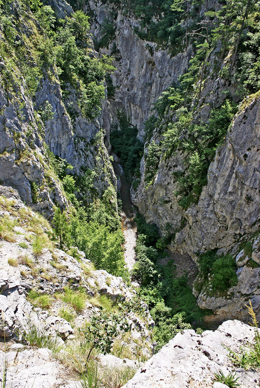
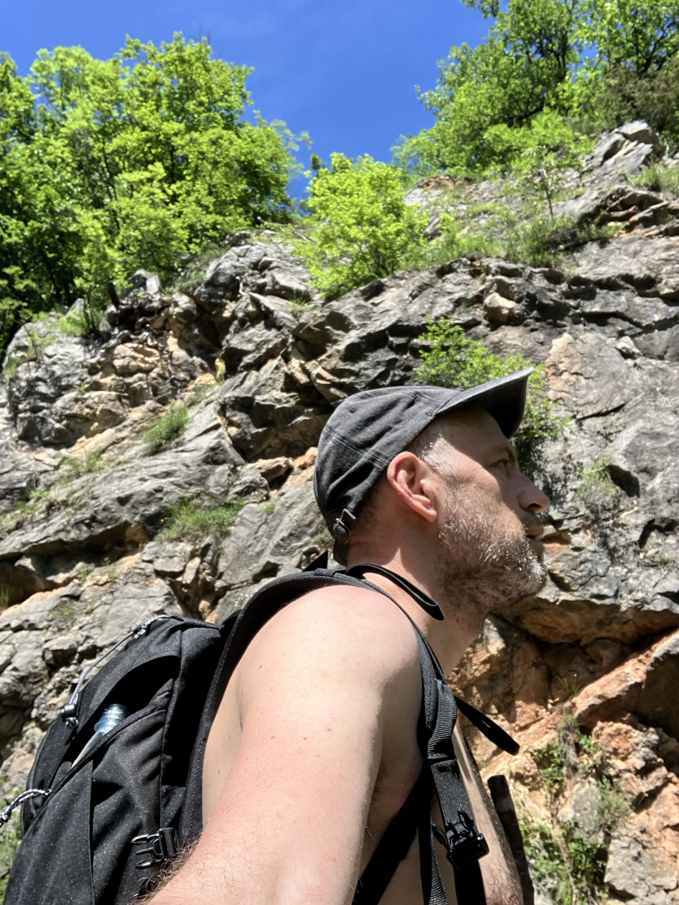
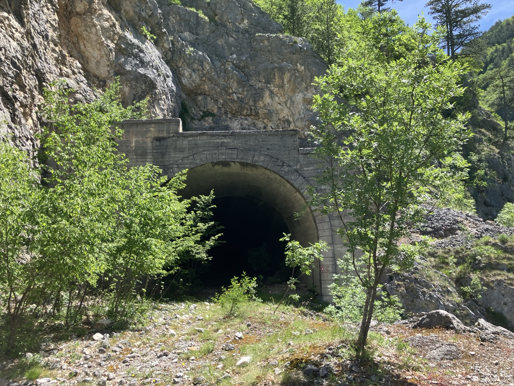
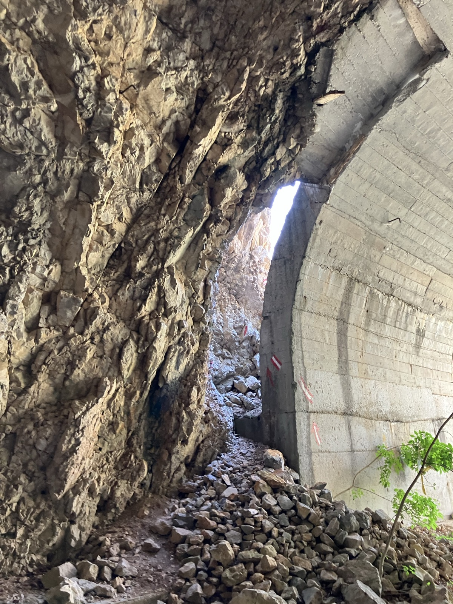
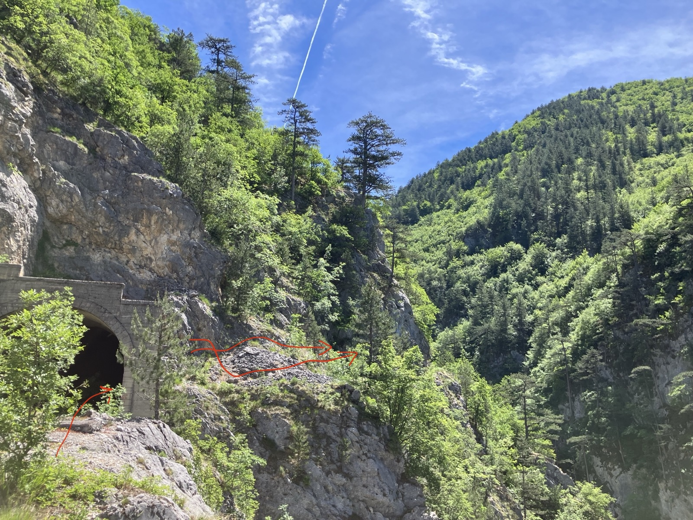
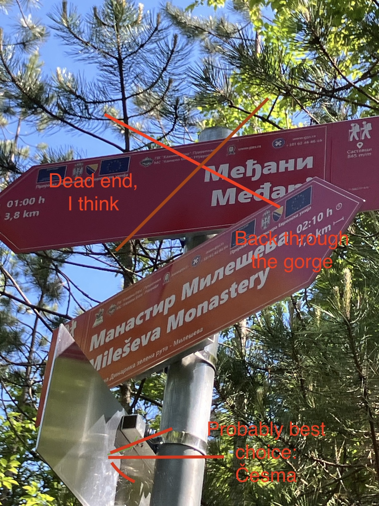
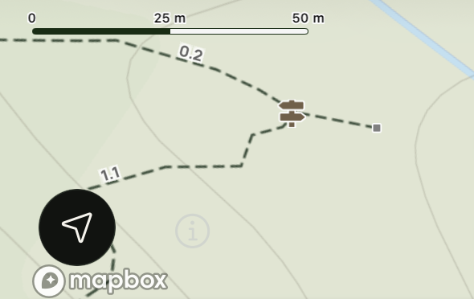
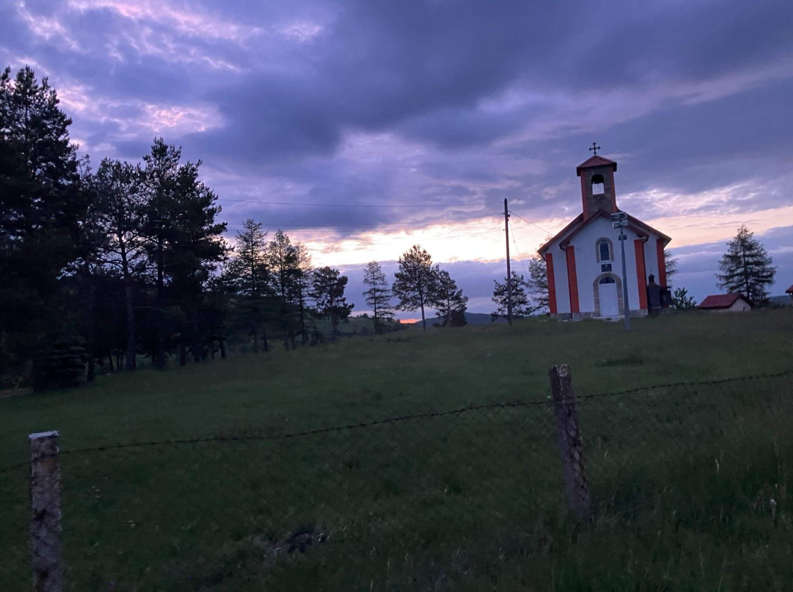
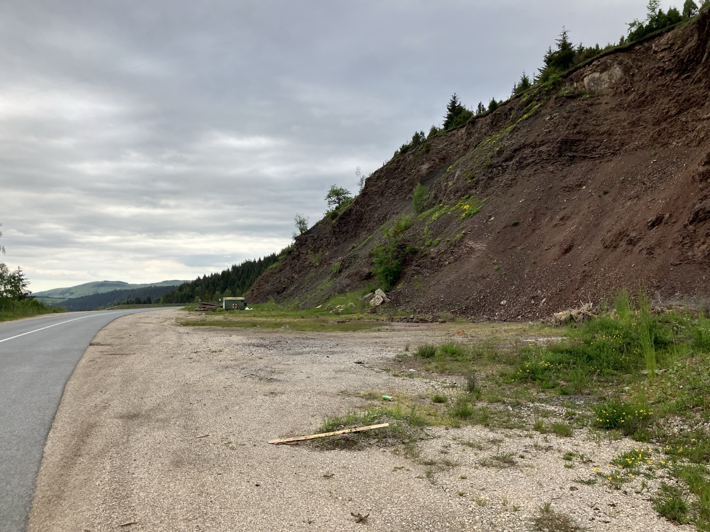
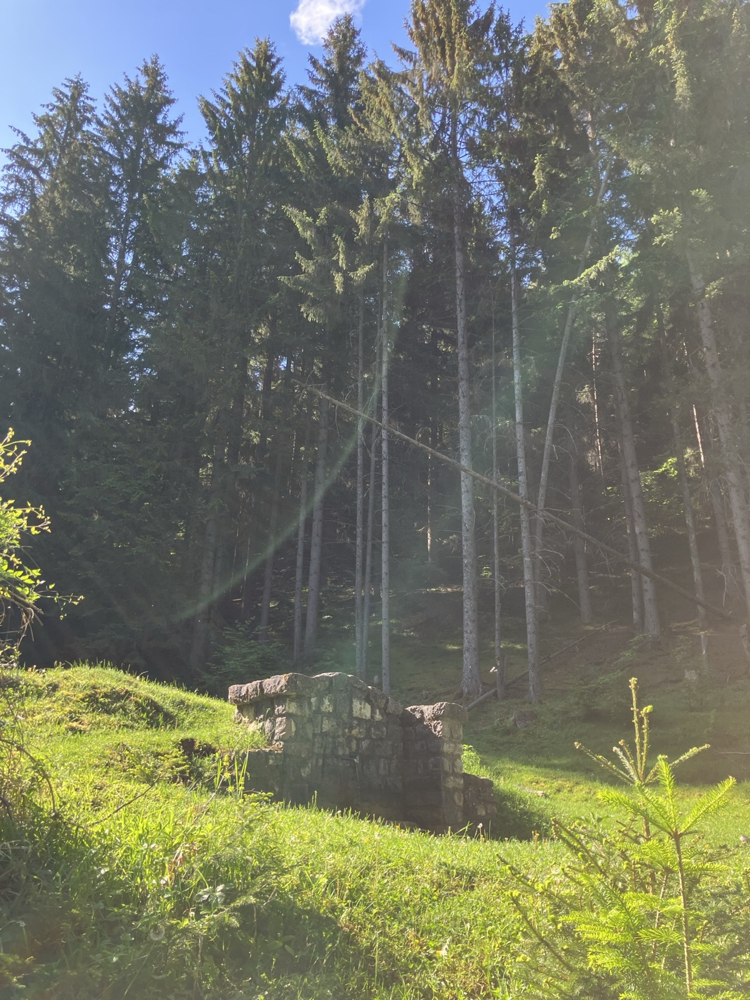

I just came back from a solo hiking trip in the Mileševka gorge; the gorge is in southwestern Serbia, in the central Balkans. I am _stunned_ by the beauty I saw in the gorge. Even though a somewhat experienced hiker, I've never seen anything like this before. 

This is a gorge located in the middle of the Balkans,  where the Dinaric mountains set off in the east. It's where the first wrinkles of this mountain massive start swinging in full force. 

The main thing I want to draw attention to in this blog post is what I believe _may_ be an incorrect hiking signage at a specifically dangerous spot in the gorge. That's at where about the hiker should work towards closing the hike and safely exiting the gorge (assuming they're hiking from the Mileševa monastery direction). Fast-forward to the end of the blog post for just that; otherwise, read on for details on this gorge. 

### The Mileševka gorge whereabouts

I am a semi-experienced hiker, with some number of trips at mountains throughout Serbia. However, this is the first time I'm on a solo hiking trip. This was a weekend project; I planned to explore the mountain [Golija](https://en.wikipedia.org/wiki/Golija_(Serbia)), but I mentioned this to my cousin [Iva](https://www.instagram.com/mountainhorsesserbia/) who lives in the mountains, some 25 km from the gorge. She said no, you should go to the Mileševka gorge, it has abandoned tunnels and is of supreme beauty. 

The Mileševka gorge is a steep cut through the rock, made by the river Mileševka over millions of years. I'm borrowing some pictures (from _Turizam Prijepolje_ and _ZZPS_):

<table>
  <tr>
    <td></td>
    <td></td>
  </tr>
</table>

At certain locations, the gorge is more than 300m deep, needless to mention the number of species that live there, including wolves, bears, eagles, etc. Notably, the gorge the second largest location where [_Picea omorika_](https://en.wikipedia.org/wiki/Picea_omorika) lives; it is a rare and beautiful plant; in the gorge, you can see them grow out of rock cliffs. 

### Solo hiking the Mileševka gorge

Packed with a tent and a sleeping bag, I embarked a bus early Friday from [Belgrade](https://en.wikipedia.org/wiki/Belgrade) to [Prijepolje](https://en.wikipedia.org/wiki/Prijepolje). I landed in a cheap motel for truckers in the outskirts of Prijepolje, where I worked from, until Friday evening. 
In the evening, I realized I was nervous about the adventure ahead, it being somewhat difficult. I went to sleep at about 10pm and woke up about 7am, with a feeling of uncertainty on how exactly to execute the trip - should I break through the full gorge or retreat when I reach the last tunnel (see below for tunnels in the gorge). 

Anyway, I took off early Saturday morning on May 30th 2026. I reached the [Mileševa monastery](https://en.wikipedia.org/wiki/Mile%C5%A1eva_Monastery), but did not feel a spiritual urge; I went in, briefly glanced at the [White Angel](https://en.wikipedia.org/wiki/White_Angel) and went out. The monastery was in busy mode; there was a group of visitors from China headed by a guide and as it was Saturday morning, a gardening activity with what appeared to be a gardening contractor took place. I sat in the monastery garden and ate a sandwich, watching the lawnmowers cut the grass around the monastery.

I walked away from the monastery to the nearby entrance to the gorge. I encountered a local, loading lumber on a small truck and asked him about the gorge. He uttered something that read like a warning: that the track is unmaintained and there are snakes. I pressed forward and encountered the first tunnel.

At this point, I can't tell whether the number of snakes is higher than one would expect; the local population, who almost never goes through the whole gorge probably _could_ overestimate the snake danger. Still, having encountered [Vipera ammodytes](https://en.wikipedia.org/wiki/Vipera_ammodytes) recently on other hiking trips, I decided to undertake systematic measures to scare off the snakes in front of me, using a wooden stick with leaves at the tip.

### The abandoned project: road from Prijepolje to Sjenica 

The hiking track unravels as an abandoned road construction project: the road to [Prijepolje](https://en.wikipedia.org/wiki/Prijepolje) to [Sjenica](https://en.wikipedia.org/wiki/Sjenica). Prijepolje and Senica are colorful cities in deep south of Serbia; they're places where the Ottoman empire left strong traces through the history of this region. These towns are gateways between the two historical empires (the Ottoman on the one hand, and the European on the other) which results in bustling diversity. If a person from the West travels towards the east through the Balkans, those are the exactly the first places they'll hear daily Muslim prayers from mosque towers scattered across the city center.

Back to the road construction: it involved carving tunnels through the rock; the demonic cliffs needed to be punctured which, I imagine, took tremendous force and sweat. It started all in 1949, with Tito's Yugoslavia pressing forward, but the project was halted in 1951. It was then restarted (by Yugoslavian authorities) some 20 years later (late 70ties), but was abandoned once again. It is chronicled in some detail [here](https://www.sjenica.com/2015/05/prijepoljci-zele-put-prema-sjenici-kroz-milesevku/?utm_source=chatgpt.com). 

### Hiking through the tunnels

The tunnels: they interchange with narrow paths that go along the sharp cliff drop. The first obstacle the hiker faces are the rocks that blockaded the trail; the rocks on the trail represent a recording of all the rockslides that happened in the last 50 years. 

<table>
  <tr>
    <td></td>
    <td></td>
  </tr>
</table>

The 9th or 10th tunnel is a dead-end tunnel; that's where the tunnels stop. There must have been a point where the workers who drilled the rock were told that the project is abandoned. This could have happened as they prepared for work next day. For no reason at all, I keep wondering what that day looked like for them and how they got transferred to work elsewhere the day after. 

### Three dangerous spots

Height-wise, the track is dangerous by itself. You should not hike it if you have fear of height or if you have any kind of stability issues, with or without a heavy backpack. Now, cliff-wise, there are three _specifically_ dangerous locations.

The first one is when you need to bypass the last (dead-end) tunnel - the track leads into the tunnel and through a hold in the tunnel wall, see the picture below. When you go through that hole, _you should make sure to not accelerate when coming down_. Stay closer to the tunnel and do not accelerate or roll downwards:

<table>
  <tr>
    <td></td>
    <td></td>
  </tr>
</table>

The second dangerous spot is a makeshift wooden rod over a hole in the ground. The hole is not dangerous by itself, but stumbling down the hole would possibly (god forbid) result in stumbling down the cliff. I don't have a picture of the wooden rod, but I've seen it at some sites; will post it here when I find the right one. When I ended the hike, a local from a nearby village asked me if the rod broke already; I responded that I think there may be a steel strenghtening inside the rod, but the local thought otherwise; I can't tell at this point. 

The third dangerous spot some time after the wooden rod; it is where the trail rock eroded; there's about half a meter of space left between the rock wall and the cliff; with a backpack, it is dangerous to cross it. 

All in all, you're on your own if you decide to hike this; be careful especially if you're carrying a heavy backpack with a tent or a sleeping bag extension, as it can interfere with straight walking. 

### The seemingly incorrect signpost

Despite the dangers, most of the trail is still well marked. As I mentioned at the beginning of the blog post, there's a dangerous exception to this. 

Towards the end of the hike when coming from the monastery direction, the trail descends into the cliff and crosses Mileševka. It leads to a place with a wooden bench and a signpost. It is quite surreal to see a wooden bench there, but the bench is likely maintained by folks that approach it from the _other_ direction, which does not require going through the gorge. 

<table>
  <tr>
    <td></td>
    <td></td>
  </tr>
</table>

After some debate I followed the Međani sign (see the pictures at the beginning of this blog post). I reached the location which, supposedly, is a dead-end - and I couldn't find the path extension -  which agrees to the hiking app trail map (see the hiking app picture on the right).

In short, I _think_ the Međani sign is wrong; I couldn't find the trail extension and the app which blindly tracks hikers' movement appears to indicate so. I cannot tell if I'm right with certainity. I'll leave it for the future to tell (I'll try to contact the folks responsible for trails to find out and will update the post if anything noteworthy comes up). 

Anyway, I reached the trail dead-end. I had two choices; go back or press forward by walking up the riverbed of the Međani brook. I opted for the latter - I managed to soldier through the foliage and waterfalls by hopping from rock to rock and walking through the thick foliage by the brook, where possible. At some point, I decided to wet my shoes to be able to move through what appeared to be impenetrable thickery of plants, waterfalls and rock. I do not recommend going this path; the risk of injury is high. Instead, I'd now take the 3rd route from the signpost - unfortunately I cannot remember the exact name of the third signpost goal, but it is a "Česma" (source of water).

### Hard becomes easy

After the gorge, I met some locals who offered me water and food (I didn't need any food). I marched forward to a church without anyone on its property (it was 8:30 pm anyway) and decided to camp in there. Here's where I slept:

I woke up at 4:30 in the morning and walked some 20 km north to [Nova Varoš](https://en.wikipedia.org/wiki/Nova_Varo%C5%A1). The only road is the main one, but there were no cars at that hour. It rained, but I didn't mind, even without any rain gear. 

<table>
  <tr>
    <td></td>
    <td></td>
  </tr>
</table>

After adventures like this, what was supposed to be hard becomes easy. 
