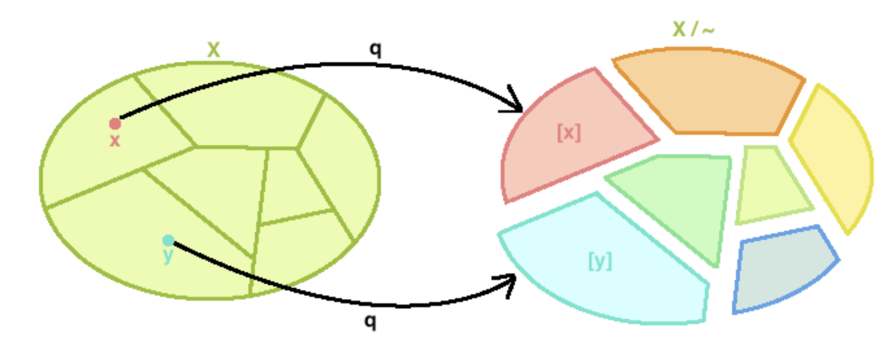
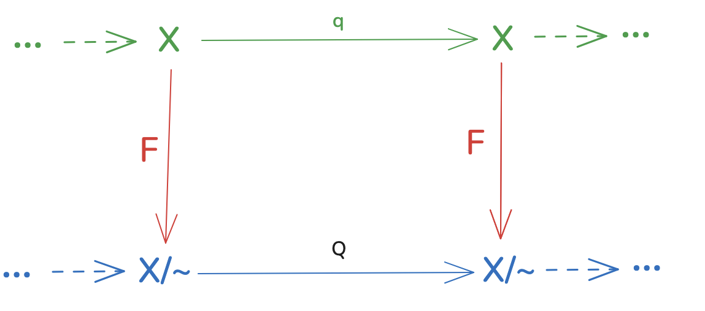
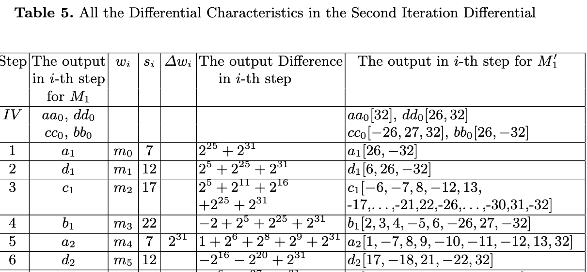
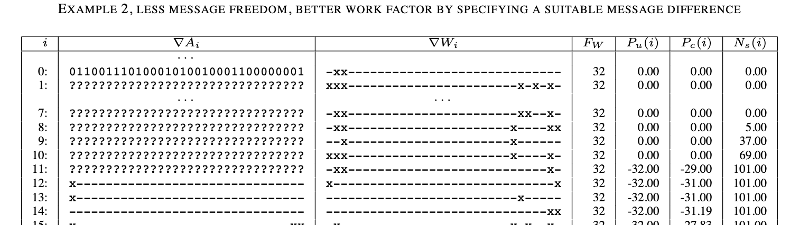
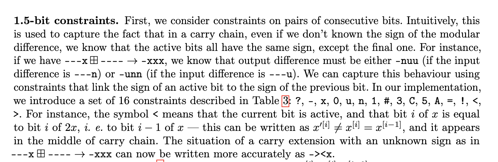

In this blog post, we introduce some explicit discussion of _abstrations_ as such. Abstractions are a natural part of reasoning, but they are not that often discussed explicitly. By an abstration, we mean omitting details from a process in view, so that the process transformation  becomes simpler, but remains faithful to the original process. 

We discuss how _quotient maps_ are the simplest notion for expressing abstractions, note a few papers that explicitly use different abstrations for the same problem (hash function collision search) and what can they be used for. We arrive at a lookout from which the possibility of identifying unexpected abstractions emerges, which is exciting. 

This research is inspired by some topics in cryptographic hash function research, but really doesn't have much to do with cryptography; more on that later. Let's first define what's the target of our notion of abstraction: a disrete mathematical transformation which has a start and end state. 

### Mappings as arbitrary processes

Consider a mapping from a finite set to itself, defined using some mathematical language. We explicitly set X to be finite, in order to avoid overly broad discussions. A mathematical language ultimately specifies a time-based transformation, so our transformation can be expressed in whichever form one likes:

* Arithmetic transformation, such as `f(x) = x^3 - x + 1 mod  p` for some prime number. An equation can be regarded as a process in time which transforms the input into an output 
* A SAT formula, which can be regarded as a transformation from input Boolean values to output Boolean values. The implication can be thought of passage of time, as left of the implication are the conditions necessary to be satisfied for the output statement to yield a true value. 
* A computer program specified in a programming language. With constructs such as assignemnt, IF and FOR, the language is Turing-complete which clearly results in intractable problems (undecidable, if the domain is allowed to be infinite).

Even though a typical diagram of a discrete function from a math textbook appears innocous, `f` can be of arbitrary complexity. Most of the problems out there can be mapped to function-related problems and as such solving them is out of reach for the general case.

### Abstraction comes to rescue

Given the mapping `f`, consider a problem such as inverting `f` for a given output value. Alternatively, consider the problem of finding a collision for `f`, two values that map to the same output. Suppose that `f` is such that the problems mentioned above are not necessarily easy. For example, `f` maybe a recurrence relation used inside a cryptographic hash function such as SHA-2, may be a difficult Diophantine equation modulo a large number.

The natural attempt to solve such a problem is to intentionally omit some details and attempt to solve a "blurred" variant of the problem (and then populate the details). The right formalism here is the quotient map (picture from [Math Online](http://mathonline.wikidot.com/topological-quotients-review)):

Instead of working with specific inputs and outputs `x`, `y`, we work with sets that contain `X` and `Y`. On the picture, the original mapping is denoted with `q` and the condition is then:

For each `x --q--> y$, we have $[x] --Q--> [y]$. 

In other words, if `x` is mapped to `y` by the original map, the corresponding "blurred" version of $x
$ and $y$ must be in correspondence with the quotient map `Q`. 

The set $X$ partition and mappings $q$ and $Q$ represent an abstraction: if all we're seeing is the partition and $Q$, then we lost some details from the original problem. 

Another way to put this is using a commutative diagram.

  

The green part of the graph represents the original, intractable process evolving through time. The abstraction function $F$ leaves details out of the process via partitioning it into subsets, yielding the new transformation $Q$. The process in blue may be an easier target to solve. 

### Application in hash function cryptanalysis

We look at some examples: how working on the abstracted view results in finding solutions for a specific problem, whereas attempting to solve the problem itself (the green line on the commutative diagram) is intractable. 

Omitting various details from a cryptographic hash function such as SHA-2, it can be seen as a recurrence relation under influence of user-controlled messages, see this hash function introductory blog post TKTK. The question is whether it's possible to find a pair of recurrence expansions, so that they end up with same values in last expanded registers. 

Note that a natural way a human thinks about the collision problems involves abstractions, right from the beginning. A human will not think in terms of specific values for the two hash executions traces, rather, a unified view is visualized with `x` at difference positions. The first breakthroughs in hash function cryptanalysis already treated the problem by unifying the two hash functions executions into a single one.   Difference propagation becomes a probabilistic process as opposed to deterministic, as it the expansion changes depending on which underlying values the hash takes.

The evolution of languages for tracking difference in hash functions can be traced as follows:

**Modular addition differences, Wang et al [1]:"** In this breakthrough work on MD4, MD5 and SHA-1, Wang and Yu consider _additive_ differences (see [1]):

  

The actual pairs their differentials specify are those for which inner registers _subtract_ (modulo word size) to specific values. 

**Bitwise differences, De Canniere et al. [2]:** All possible bit combinations are assigned a sign, for example `(0,0)` and `(1,1)` are assigned the symbol `-` and `(0,1)` and `(1,0)` the symbol `x`, [2].  The differential path problem then takes the form:

   

Since these are bit-wise conditions, they need to be complemented with carry bit information; that's a separate representation, not shown on the graph (and commonly not shown in the papers on hash functions). 

**Multi-bit constraints [3]:** Laurent extends the bit-wise constraints to multi-bit constraints. The rationale is - multi-bit constraints capture dependencies lost by single-bit constraints, see the explanation from the paper:

  

### Research project: how to derive an abstraction

In the previous section, we saw that the first abstraction (Wang et al.) was derived from the internal structure of the hash: the modular addition is the main function in a hash. In some sense, Wang's abstraction follows the natural flow of the process. 

The bit-wise differences make sense as, apart from modular addition, all other hash found operations are bit-wise. It also makes sense from human perception viewpoint, where one would write an X where a bit is "activated", that is, where a difference is injected. The multi-bit differences are a natural extension of single-bit differences.

This all leads to the following intuition: **it is more than plausible that a generic procedure from which the three abstractions discussed in the previous section can be derived**. We put forward a research project, some of which questions were likely answered in literature, as it usually is the case:

* Determine the systematic procedure used to derive abstractions such as the three above. If such a derivation exists in literature, connect it to the hash function papers and explain the transformation. Otherwise, derive the transformation yourself and deduce the abstractions from the papers. 
* Related: this problem was likely looked at in the past: consider a  map for discrete function f: X->X on a finite domain X. Given a partition of X, the corresponding set mapping on the partition will either be a quotient map, or not. That's defined by the quotient condition. So, for the given map, is there an algorithm to determine all possible partitions that are proper quotient maps? However, it is unlikely that such is efficient, since it disregards the potential known inner structure of the origin mapping. 
* Specifically to hash function differential trail search heuristics: which abstraction is _optimal_ in the sense that it is not too heavy-weight on memory/cache/CPU and yet derives solutions? There's a clear tradeoff here, as the memory tables holding abstracted language propagation rules grow exponentially.
* Is there a generic procedure, given an abstraction, makes it more or less coarse; how can abstractions be tuned along a fixed axis? Do different abstractions live across axes, or are independent creatures?
* What mappings are at the ends of the spectrum in the number of abstractions they amend to, vs. those that have a minimal number of abstractions. Could the unabstractable mappings correspond to S-boxes in cryptography? Non-linearity?
* Study a math problem of your choice (such as, a difficult Diophantine equation) and introduce a novel abstraction which sheds new light on the problem. 

[1]: [How to Break MD5 and Other Hash Functions](https://iacr.org/archive/eurocrypt2005/34940019/34940019.pdf)
[2]: [Finding SHA-1 Characteristics: General Results and Applications](https://link.springer.com/chapter/10.1007/11935230_1)
[3]: [Analysis of Differential Attacks in ARX Constructions](https://who.rocq.inria.fr/Gaetan.Leurent/files/ARX_AC12_full.pdf)

