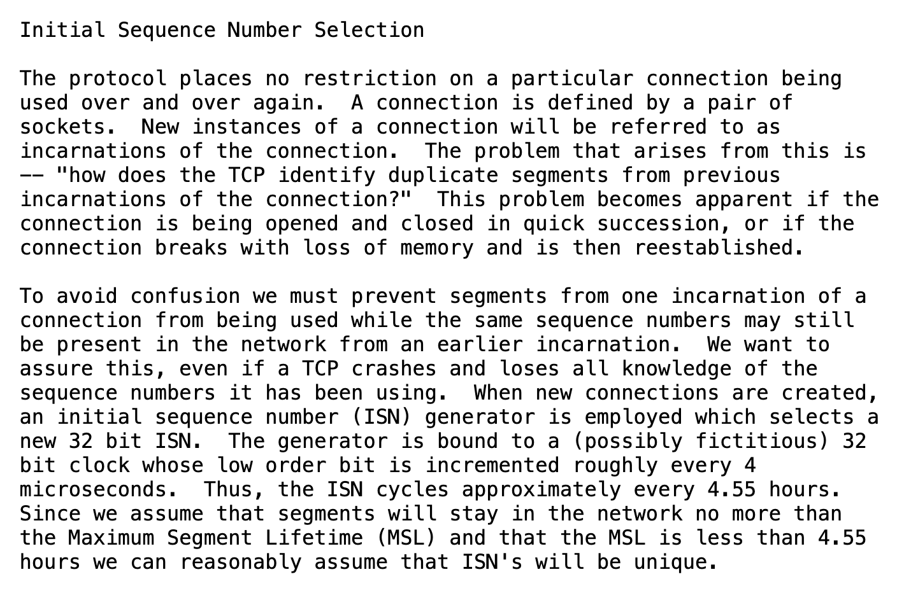
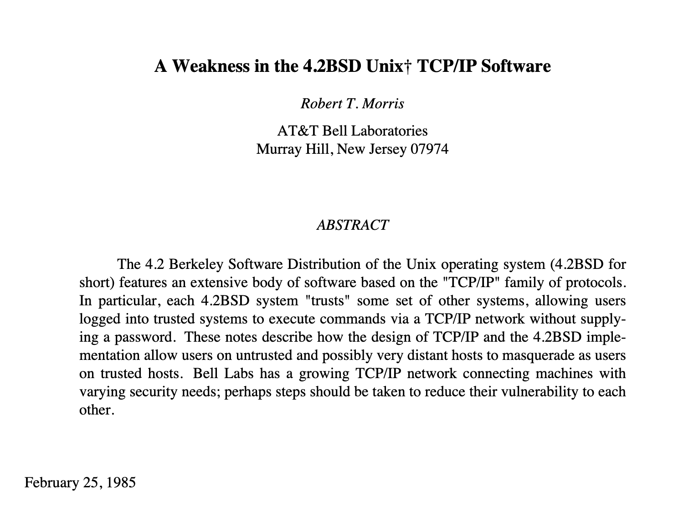
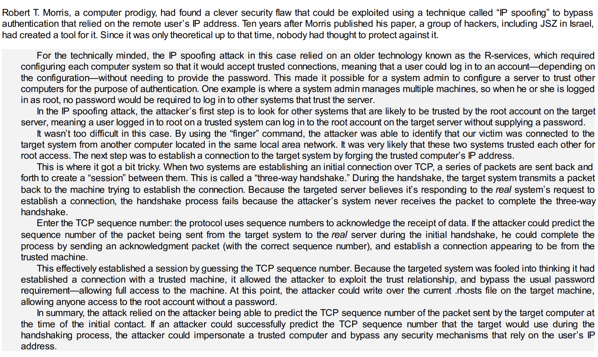

Some security controls are more straightforward than others. The straightforward controls are those that are backed by direct and abundant trust assumptions. For example: server-side validation of JWT tokens. The server trusts a certain public key that the parties agreed on (direct trust assumption) and validates signatures according to that key.

Some other security controls are not straightforward at all. The trust assumptions they operate with are scarce and unfriendly. For example, Bitcoin: it was in fact the very idea of Bitcoin to remove the direct trust assumption - a central server that's in charge of token issuance and transaction validity. In a way, Bitcoin managed to build strong security out of nothing. 

In this blog post, we look at an ancient security control: the (early Internet) defense against TCP spoofing. To a degree, the TCP protocol manages to "authenticate" source IP addresses in TCP connections, despite the fact that there are no direct trust assumptions. For example, there are no pre-set private keys nor certificates. This is what makes this control interesting.

### 1. The hub 

Consider a local area network with `n` nodes. To connect the nodes, the number of necessary links grows quadratically with `n`. It's necessary to introduce an optimization: a single node through which all traffic flows.

If that single forwarding node does not keep a state, it has no way of knowing to which nodes it should forward incoming packets to. Such a device can then resort to simply broadcasting incoming packets to all connected nodes and letting the nodes accept or discard packets accordingly. 

This approach was common in the distant past with a device called the [hub](https://en.wikipedia.org/wiki/Ethernet_hub). It's network hubs that allowed easy sniffing on local networks. If the connecting interface on a node is set to what's called [promiscuous](https://en.wikipedia.org/wiki/Promiscuous_mode) mode, it releases all the packets that arrive on the network, creating a hacker bonanza. 

Hubs fail to provide any security. As for message authentication, the hub has no state, so it's the sender that chooses the source packet address afresh for each packet. There's also no message confidentiality, packets necessarily reach all nodes and thus can be sniffed by all nodes on the network. 

### 2. The switch

A [switch](https://study-ccna.com/how-switches-work/) is a stateful forwarding device. It keeps a physical port / address mapping in its cache. The packets don't cross every node on the network, each packet passes through a single physical port, as determined by the mapping. 

The fact that nodes do not see other nodes' traffic can be seen as a security property. As long as the state tables are correct, a malicious node doesn't get to capture traffic aimed for other nodes. 

Switches are better than hubs in terms of security; packet vs. node separation isn't much, but it's *something*. The security property is, however, a weak one, as a number of poisoning attacks are possible. The attacks are non-surprising and a simple consequence of trusting other nodes when it comes to addresses. 

* **ARP cache poisoning**: When sending packets, nodes on a LAN translate IP addresses to MAC addresses. The translation is done via ARP. A node broadcasts a packet asking about an IP address and the correct node responds with a MAC address. The ARP response is simply trusted as valid, which makes it susceptible to attack. 
* **ARP cache poisoning of the routing device cache**: The switch cache is filled out based on the information the switch has access to, which includes ARP and source address information. There's no a guarantee that this information is correct and thus can be poisoned.
* **Blind packet spoofing**: A node on a LAN can claim arbitrary source MAC addresses. This attack is relevant in the context of [VLAN hopping](https://en.wikipedia.org/wiki/VLAN_hopping) which we leave for another discussion.

### 3. The Internet

A switch, described in the previous section, is a miniaturized variant of the Internet. With the difference that the routing cache of a switch is wholly contained inside the switch, as opposed to being scattered across routing devices on the Internet. 

This self-similarity feature means that the attacks from the previous section apply on  the Internet in some shape or form. For example, ARP cache poisoning is analogous to DNS cache poisoning; it's unauthenticated resolution of aliases stored in end-devices. ARP cache poisoning against the tables in the switch is similar to BGP poisonining attacks, etc. 

Now the interesting part: with an assumption that nodes between the client and the server aren't malicious or corruptible, it's possible to prevent TCP packet spoofing. Recall that the TCP protocol is built on top of the IP protocol[^ipproto] and that each TCP connection starts out with a 3-way handshake.  Recall also that the 3-way handshake consists of SYN, SYNACK and ACK packets. The handshake involves two 32-bit numbers, the  sequence number chosen by the client and the sequence number chosen by the server. From the [RFC 793](https://datatracker.ietf.org/doc/rfc793/):

> The synchronization requires each side to send its own initial sequence number and to receive a confirmation of it in acknowledgment from the other side.  Each side must also receive the other side's initial sequence number and send a confirming acknowledgment.
>    1) A --> B  SYN my sequence number is X
>   2) A <-- B  ACK your sequence number is X
>    3) A <-- B  SYN my sequence number is Y
>    4) A --> B  ACK your sequence number is Y
> Because steps 2 and 3 can be combined in a single message this is called the three way (or three message) handshake.

If the client claims an invalid source address during the 3-way handshake, the client does not receive the server-chosen sequence number. Breaking down the assumptions necessary for this spoofing mitigation to be secure:

* Server-to-client packet routing works as expected 
* Sequence numbers are chosen purely randomly
* Intermediate nodes don't leak or use sequence numbers passing through them
* Brute-forcing the number does not provide a meaningful advantage to the attacker.

From those assumptions, spoofing resistance for the TCP protocol is achieved. The assumption on nodes not being malicious worked out in pratice on the Internet. 

### How to introduce, identify and exploit a security bug (on a 5 year cadence)

John Postel (1981), Robert Morris (1985) and Kevin Mitnick (1991) had a role in this story. 

The TCP standard RFC 793 came about in 1981, but Jon Postel mentions 9 (1) previous variants of ARPA TCP on which the standard is based on. The standard did not mandate that the numbers are generated randomly. The r-suite of protocols (`rlogin`, `rsh`, etc) that blindly trusted source IP addresses came about in the early 80ties and was around in the 90ties. In 1985, Robert Morris wrote a paper about IP address spoofing; the paper reads almost as a scientific paper that can be submitted to a conference. Finally, in ab out 1994, Kevin Mitnick and some Israeli hackers exploited the bug. 

It's possible, or even likely, that some time during the 80ties, somewhwere in the world, someone else realized that this is possible and even tried it out. That'd be good to know, if you're aware, please let me know by email (akircanski at gmail) and I'll add it to this blog post. 

* [RFC 793](https://datatracker.ietf.org/doc/rfc793/): does not prescribe that the sequence number should be chosen using a cryptographically secure RNG. Due to lack of specification in this regard, TCP implementations varied in how they choose the numbers. 

* [A Weakness in the 4.2BSD Unix TCP/IP Software](http://nil.lcs.mit.edu/rtm/papers/117.pdf): Robert Morris broke the TCP protocol in this paper, based on predictability of sequence numbers. Apart from guessing the sequence number, the attack relies on choking the spoofed source address so that it cannot signal that something's wrong to the receiving host. This is an impressive paper on security that was ahead of its time. The abstract shown below focuses on the remote login family of Unix protocols, but the underlying condition that makes the attacks possible is the non-randomness of TCP sequence numbers.

[Ghost in the Wires](https://bibliocecifi.wordpress.com/wp-content/uploads/2017/05/ghost-in-the-wires-kevin-mitnick.pdf): The Morris' paper was published in 1985. In his book, Kevin Mitnick describes how in 1994, the attack was deployed in practice. It took about ten years for hackers to understand that the attack is not theoretical-only and that it can be implemented.

### Recap

The *hub* as a device offered no security, rather, it offered hackers a packet sniffing opportunity. The *switch* segmented packet traffic between nodes by keeping an internal routing table, however, the table couldn't be trusted. There exist easy attacks that corrupt the information comprising the routing for nodes connected to the switch.

If one decentralizes the routing tables by scattering them across Internet nodes, it's clearly still possible to attempt to corrupt the routing tables (e.g. by BGP attacks or malicious inter-nodes). However, the incentives don't result in easily executable attacks any more and the incentives and the number of such attacks in practice die out. 

This effectively results in a form of IP address spoofing resistence that's sufficiently good for the Internet. From a different direction, software stacks don't _critically_ rely on IP spoofing impossibility, making the security control a "midway" one and viable in practice. These all are the reasons why the early Internet TCP control spoofing mitigations is a fascinating security control. 

If you want to build security, attempt to achieve it  despite unfriendly and scarce trust assumptions. If you succeed,  you'll end up with a fascinating security control. 

Thanks to Paul Bottinelli for revewing this blog post (and coming up with the final title)! 

[^ipproto]: Sending out an IP packet over the Internet really is a shot in the dark. If the packet does not arrive at the destination, you don't know. As the packets travels over the Internet backbones, its TTL decrements and the packet dies out if the TTL drops to zero. If the packet does arrive to the destination, you don't know either - there's no "signal back" in the IP protocol. Intermediate hops are free to defragment the IP packet. As the sender, you don't know whether fragmentation took place or not; the receiving node are the ones that'll be responsible for reassembling the packet (in that sense, the IP protocol is not _completely_ stateless). Each IP packet claims a certain source address, but the intermediate and destination nodes have little idea if the source address is correct, or not. The TCP protocol takes this unreliable primitive (the IP packet) and transforms it into a reliable one. 
